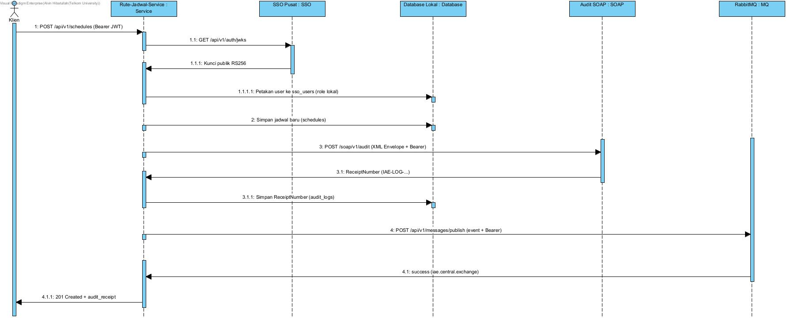

# Analisis Tugas 3 — Rute & Jadwal Service

**Nama:** Alvin Hibatullah  
**NIM:** 102022430022  
**Mata Kuliah:** BBK2HAB3 — Integrasi Aplikasi Enterprise  
**Service:** Rute & Jadwal (`102022430022_Rute-Jadwal-Service`)  
**Team ID:** TEAM-12  
**Resource utama:** `schedules`

---

## 1. Transaksi Kritis yang Dipilih

Service Rute & Jadwal yang saya kembangkan memiliki tiga endpoint, namun hanya satu yang benar-benar mengubah keadaan sistem, yaitu pembuatan jadwal baru melalui `POST /api/v1/schedules`. Endpoint inilah yang saya pilih sebagai transaksi kritis.

Alasannya menjadi jelas ketika dibandingkan dengan dua endpoint lain. `GET /schedules` dan `GET /schedules/{id}` sifatnya hanya membaca data — keduanya tidak pernah menyentuh atau mengubah isi database, sehingga dipanggil berapa kali pun keadaan sistem tetap sama. Sebaliknya, `POST /schedules` menulis baris baru ke database setiap kali dijalankan, dan di situlah letak konsekuensinya.

Yang membuat transaksi ini kritis bukan sekadar karena ia menulis data, melainkan karena jadwal yang dibuat menjadi acuan bagi service lain di dalam ekosistem kelompok. Service Tiket & Pembayaran, misalnya, menjual tiket berdasarkan jadwal yang tersedia. Artinya, bila ada jadwal yang keliru, dampaknya merembet langsung ke transaksi keuangan di service hilir — bukan sekadar masalah lokal di service saya sendiri. Karena menyangkut data operasional yang bermuara pada uang, setiap pembuatan jadwal wajib dicatat ke sistem audit legacy (SOAP) sebagai jejak pertanggungjawaban: siapa yang membuat, kapan, dan apa isinya. Di sisi lain, departemen lain juga perlu segera mengetahui adanya jadwal baru, sehingga peristiwa ini disiarkan ke message broker (RabbitMQ) agar dapat dikonsumsi service mana pun tanpa harus saling terhubung secara langsung.

Dengan pertimbangan-pertimbangan tersebut, `POST /schedules` menjadi satu-satunya transaksi pada service ini yang memicu rantai integrasi secara penuh, mulai dari verifikasi identitas lewat SSO, pencatatan ke audit SOAP, hingga penyiaran event ke RabbitMQ.

## 2. Skema Role Lokal

Pada tugas sebelumnya, pengamanan service masih mengandalkan API Key statis berupa header `X-IAE-KEY`. Di tugas ini saya menggantinya dengan JWT yang diterbitkan oleh SSO pusat, sehingga identitas pengakses tidak lagi ditebak dari sebuah kunci tetap, melainkan diverifikasi dari token yang sah.

Alurnya berjalan seperti berikut. Setiap permintaan yang masuk harus membawa token pada header `Authorization: Bearer <JWT>`. Token itu kemudian diperiksa oleh middleware `VerifyIaeJwt`, yang lebih dulu mengambil kunci publik dari endpoint JWKS (`/api/v1/auth/jwks`) lalu memverifikasi tanda tangan token menggunakan algoritma RS256. Setelah token dipastikan asli, middleware membaca klaim di dalamnya — terutama `sso_subject` sebagai identitas pengguna dan `roles`. Identitas ini lalu dipetakan ke sebuah tabel lokal bernama `sso_users`, yang menyimpan `sso_subject`, `roles`, dan `last_login_at` sebagai cerminan lokal dari identitas yang dikelola SSO pusat.

Dari pemetaan itu, saya menyusun skema kapabilitas sederhana berbasis role. Pengguna yang membawa role operasional tertentu — misalnya `schedule_admin` — diizinkan melakukan transaksi yang mengubah data seperti `POST /schedules`. Sementara pengguna tanpa role khusus hanya diperlakukan sebagai pembaca, yakni dibatasi pada endpoint `GET` saja. Dengan begitu, kewenangan membuat jadwal tidak diberikan sembarangan, melainkan menempel pada peran yang dibawa token.

Identitas pembuat (`sso_subject`) pun tidak berhenti di middleware, tetapi ikut dibawa sampai ke audit SOAP dan event RabbitMQ melalui field `approved_by`. Inilah yang membuat setiap transaksi kritis dapat ditelusuri pelakunya di kemudian hari.

Sebagai catatan, akun yang saya pakai saat pengujian, `warga17@ktp.iae.id`, ternyata tidak memiliki role khusus dari SSO pusat (`roles: []`), sehingga diperlakukan sebagai pengguna terautentikasi biasa. Meski begitu, mekanisme pembacaan dan pemetaan role-nya sendiri sudah berjalan sebagaimana mestinya — yang kosong memang karena akunnya belum diberi role, bukan karena logikanya gagal.

## 3. Sequence Diagram — Alur Interaksi dengan Layanan Pusat

## 4. Ringkasan Implementasi

Secara keseluruhan, ketiga modul integrasi sudah berjalan dan saling terangkai dalam satu transaksi.

Pada sisi Federated SSO, service memverifikasi JWT menggunakan kunci publik RS256 dari JWKS, lalu memetakan pengguna ke tabel `sso_users`. Bukti bahwa bagian ini berfungsi terlihat dari perilaku endpoint-nya: permintaan tanpa token ditolak dengan status 401, sedangkan permintaan dengan token yang sah menghasilkan 200, dan baris identitas pengguna benar-benar muncul di tabel `sso_users`.

Pada sisi SOAP XML Client, data transaksi yang semula berbentuk JSON diubah menjadi SOAP Envelope yang kaku, lalu dikirim ke endpoint `/soap/v1/audit`. Nomor resi yang dikembalikan layanan pusat tidak sekadar diterima, tetapi juga disimpan ke tabel `audit_logs`. Salah satu contoh resi yang tersimpan adalah `IAE-LOG-2026-54B6C14B`, lengkap dengan nama aktivitas serta payload-nya.

Pada sisi AMQP Publisher, setiap jadwal yang dibuat disiarkan sebagai event JSON ke exchange `iae.central.exchange` dengan routing key `schedule.created`. Event ini benar-benar sampai di broker dan dapat dilihat pada papan `/board`, ditandai sebagai kiriman dari TEAM-12.

Yang cukup menjelaskan keseluruhan rancangan ini adalah isi event-nya: setiap pesan yang diterbitkan turut membawa `legacy_receipt_number` dari audit SOAP sekaligus `approved_by.sso_subject` dari SSO. Hadirnya kedua data itu dalam satu pesan menjadi bukti bahwa ketiga integrasi — identitas, audit, dan penyiaran event — memang terangkai dalam satu transaksi `POST /schedules`, bukan berjalan sendiri-sendiri.