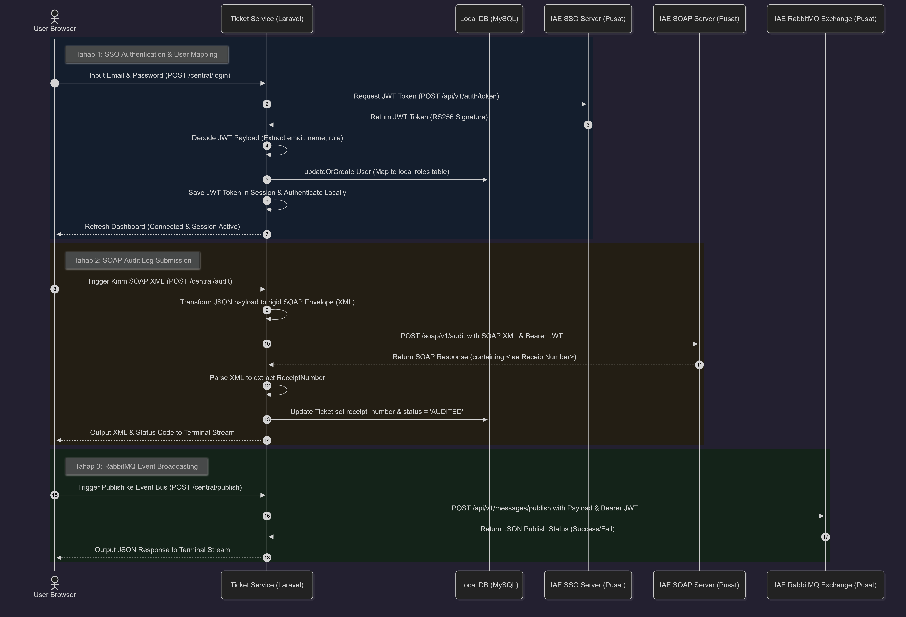

# Analisis Integrasi Tugas 3 - Sistem Tiket & Pembayaran
**Nama:** Bayu Samudera  
**NIM:** 102022400251  
**Layanan:** Ticket & Payment Service  

---

## 1. Justifikasi Transaksi Kritis & Publikasi Event

Dalam sistem pemesanan transportasi, proses **Pembelian Tiket (Ticket Purchase)** dinilai sebagai **Transaksi Kritis (Critical Transaction)** karena alasan-alasan berikut:

1. **State-Changing (Perubahan Status Finansial & Inventori):** Transaksi ini mengubah status reservasi dari "Dipesan" menjadi "LUNAS", mengalokasikan nomor kursi penumpang (`seat_number`), dan mencatat total uang masuk (`total_price`). Kegagalan pencatatan dapat menyebabkan masalah fatal seperti *double-booking* atau selisih keuangan.
2. **Akuntabilitas & Audit Trail (Legasi SOAP XML):** Untuk mencegah *fraud* (kecurangan) keuangan atau penghapusan log transaksi secara lokal, setiap transaksi kritis wajib dilaporkan ke server audit eksternal milik pusat. Penggunaan protokol SOAP XML menjamin keabsahan data log transaksi menggunakan format pesan yang kaku (*strongly-typed*) dan mengembalikan nomor resi unik (`ReceiptNumber`) yang disimpan sebagai bukti audit hukum.
3. **Sinkronisasi Asinkron (RabbitMQ Broadcast):** Transaksi tiket yang sukses memiliki efek berantai terhadap departemen/suku lain (misalnya departemen jadwal keberangkatan untuk validasi manifest penumpang, atau departemen delay untuk notifikasi penumpang). Dengan mempublikasikan event `TicketPurchased` secara asinkron ke RabbitMQ exchange (`iae.central.exchange`), suku lain dapat langsung memproses manifest secara efisien tanpa membuat service tiket terbebani.

---

## 2. Sequence Diagram Aliran Interaksi

Berikut adalah **Sequence Diagram** yang menggambarkan alur interaksi antara Browser Pengguna, Layanan Tiket lokal kita, Database lokal, dan Server Pusat IAE (SSO, SOAP Audit, dan RabbitMQ):



### Detail Langkah Urutan Interaksi (1 - 18)

| No | Pengirim | Penerima | Deskripsi Aktivitas / Aksi |
|:---:|---|---|---|
| **1** | User Browser | Ticket Service (Laravel) | Pengguna mengisi kredensial dan menekan tombol login (`POST /central/login`). |
| **2** | Ticket Service (Laravel) | IAE SSO Server | Mengirimkan email warga & password untuk request token JWT (`POST /api/v1/auth/token`). |
| **3** | IAE SSO Server | Ticket Service (Laravel) | Memvalidasi kredensial dan mengembalikan JWT Token bertanda tangan digital RS256. |
| **4** | Ticket Service (Laravel) | Ticket Service (Laravel) | Mengurai payload base64 dari token JWT secara internal untuk mengekstrak `email`, `name`, dan `role`. |
| **5** | Ticket Service (Laravel) | Local DB (MySQL) | Menyimpan data user SSO ke tabel `users` lokal serta memetakan perannya (*SSO User Mapping*). |
| **6** | Ticket Service (Laravel) | Ticket Service (Laravel) | Menyimpan token JWT ke dalam session PHP aplikasi untuk validasi transaksi selanjutnya. |
| **7** | Ticket Service (Laravel) | User Browser | Merefresh tampilan dashboard (Indikator status berubah menjadi **ACTIVE**). |
| **8** | User Browser | Ticket Service (Laravel) | Pengguna menekan tombol "Kirim SOAP XML" untuk mengaudit tiket (`POST /central/audit`). |
| **9** | Ticket Service (Laravel) | Ticket Service (Laravel) | Mengonversi data JSON tiket dari database menjadi string XML kaku berskema SOAP Envelope. |
| **10** | Ticket Service (Laravel) | IAE SOAP Server | Melakukan POST XML SOAP audit ke server legacy dengan melampirkan Bearer JWT di header. |
| **11** | IAE SOAP Server | Ticket Service (Laravel) | Memproses data audit dan mengembalikan XML respon berisi `<iae:Status>SUCCESS</iae:Status>` dan `<iae:ReceiptNumber>`. |
| **12** | Ticket Service (Laravel) | Ticket Service (Laravel) | Mengekstrak nilai teks di dalam tag `<iae:ReceiptNumber>` menggunakan pencocokan regex. |
| **13** | Ticket Service (Laravel) | Local DB (MySQL) | Meng-update record tiket di database lokal dengan menyimpan `receipt_number` dan status `AUDITED`. |
| **14** | Ticket Service (Laravel) | User Browser | Menampilkan respon XML SOAP mentah dan status kode HTTP ke terminal monitor dashboard. |
| **15** | User Browser | Ticket Service (Laravel) | Pengguna menulis pesan event JSON dan menekan tombol "Publish ke Event Bus" (`POST /central/publish`). |
| **16** | Ticket Service (Laravel) | IAE RabbitMQ Exchange | Mengirimkan JSON event payload ke REST API proxy RabbitMQ Dosen dengan membawa Bearer JWT. |
| **17** | IAE RabbitMQ Exchange | Ticket Service (Laravel) | Broker menempatkan event di queue exchange dan mengembalikan respon sukses JSON (`status: "success"`). |
| **18** | Ticket Service (Laravel) | User Browser | Menampilkan respon sukses publikasi JSON ke terminal monitor dashboard. |

---


## 3. Capaian Teknis Implementasi

### Modul 1: Federated SSO
Aplikasi telah sukses menangkap token JWT dari gerbang SSO pusat. Token didekode untuk mengambil informasi *claims* (`email`, `name`, `role`). Informasi tersebut dipetakan ke tabel database lokal (`users`) dengan memanfaatkan skema kolom `role` yang dinamis:
```php
$user = User::updateOrCreate(
    ['email' => $payload['email']],
    [
        'name' => $payload['name'] ?? $payload['username'],
        'password' => bcrypt('SSO_DUMMY_PASSWORD_' . uniqid()),
        'role' => $payload['role'] ?? 'warga'
    ]
);
```

### Modul 2: SOAP XML Client
Logika client SOAP berhasil mentransformasikan data transaksi berformat JSON menjadi dokumen XML kaku berskema SOAP Envelope, lalu menembakkannya ke server audit. Begitu respon diterima, aplikasi membaca dokumen XML tersebut, mengekstrak nomor resi unik (`ReceiptNumber`), dan menyimpannya di kolom `receipt_number` tabel `tickets` lokal:
```php
if (preg_match('/<iae:ReceiptNumber>(.*?)<\/iae:ReceiptNumber>/', $rawResponse, $matches)) {
    $receiptNumber = $matches[1];
    $ticket->update(['receipt_number' => $receiptNumber, 'status' => 'AUDITED']);
}
```

### Modul 3: AMQP Publisher
Mengirimkan notifikasi event terstruktur dalam bentuk JSON payload ke REST API proxy exchange `iae.central.exchange` dengan otentikasi Bearer JWT yang valid dari SSO:
```php
$response = Http::withToken($token)->post($baseUrl . '/api/v1/messages/publish', [
    'exchange' => 'iae.central.exchange',
    'routing_key' => 'ticket.event',
    'payload' => $payload
]);
```
